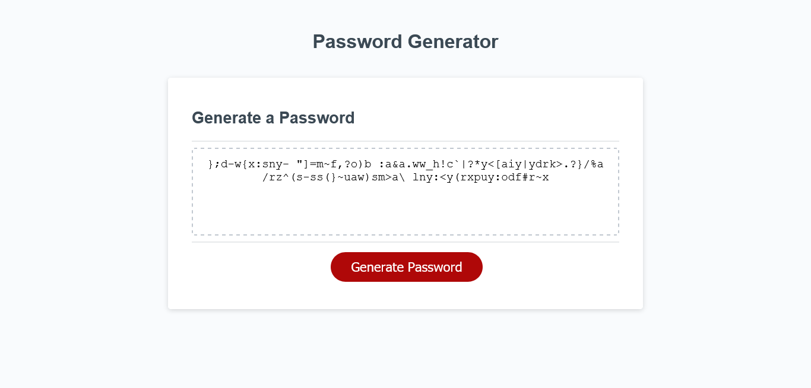

# Random-Password-Generator

## Description
This is a webpage for a random password generator. Upon pressing the "generate" button, the user will be prompted to enter the desired length of the password. After that, the user will confirm whether or not they want it to include lowercase letters, uppercase letters, numbers, and special characters. Once this is complete, the password will appear in the text box.

## Live Site
https://mattyp1007.github.io/Random-Password-Generator/

## Screenshot

